# iThome Ironman AutoPost

這是一套使用 TypeScript、Playwright 與 GitHub Actions 製作的 iThome 鐵人賽自動發文範本。完成設定後，每天會依序驗證文章、儲存並讀回草稿、正式發布，再透過公開頁面與系列 RSS 確認結果。

> [!WARNING]
> 這不是 iThome 官方工具。只要網站的 DOM、表單或登入流程改版，自動化腳本就可能需要跟著調整。第一次使用時，請先依序完成 Preview、Save draft 與手動 Publish；三個階段都確認成功後，再開啟每日排程。

## 先看這張圖：10 分鐘完成基本設定

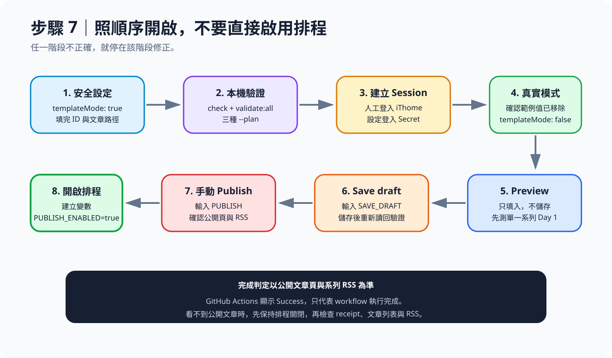

照這個順序完成：

- [ ] Fork 公開範例，或 Clone 後推送到自己的 Private Repo。
- [ ] 在 iThome 完成系列報名，並替每個系列建立 Day 1 草稿。
- [ ] 把文章放進 `articles/<series-key>/Day01.md` 到最後一天。
- [ ] 填完 [config/series.yml](config/series.yml)，暫時保持 `templateMode: true`。
- [ ] 執行測試、文章驗證及三種 `--plan`。
- [ ] 人工登入 iThome，將 storage state 存成 GitHub Secret。
- [ ] 把 `templateMode` 改成 `false`，依序執行 Preview、Save draft、手動 Publish。
- [ ] 公開文章與系列 RSS 都正確後，才建立 `ITHOME_PUBLISH_ENABLED=true`。
- [ ] Github 賞個 Star！！！

## 開始前，先準備好這些

- Git、[Node.js 24](https://nodejs.org/) 或更新版本、npm。
- 可以登入 iThome 的帳號。
- 已完成報名的 iThome 鐵人賽系列。
- 每個系列都先在 iThome 建立 Day 1 草稿，但不要先發布。
- 可以建立 GitHub Repo、Actions Secret 與 Variable 的權限。

### 第一次使用 PowerShell

這份教學中的指令都在 Windows PowerShell 執行，不需要使用「以系統管理員身分執行」。

1. 按下鍵盤的 Windows 鍵，或點選工作列上的 Windows 圖示。
2. 輸入 `PowerShell`。
3. 開啟 **Windows PowerShell** 或 **PowerShell**。
4. 看到類似 `PS C:\Users\你的帳號>` 的文字，就可以開始輸入指令。

先把下面三行逐行貼到 PowerShell。每貼一行就按一次 Enter：

```powershell
git --version
node --version
npm.cmd --version
```

三行都應顯示版本號，例如 `git version 2.x.x`、`v24.x.x` 與 `11.x.x`。如果出現「無法將名稱辨識為 Cmdlet、函式、指令碼檔案或可執行程式」，代表該工具尚未安裝，或安裝後還沒有重新開啟 PowerShell。

> [!TIP]
> 複製指令時，只複製程式碼區塊裡的內容。不要複製 `PS C:\...>`、行號或程式碼區塊外面的三個反引號。路徑裡如果有空白，請保留左右兩側的雙引號。

## 步驟 0：Fork 還是 Clone？

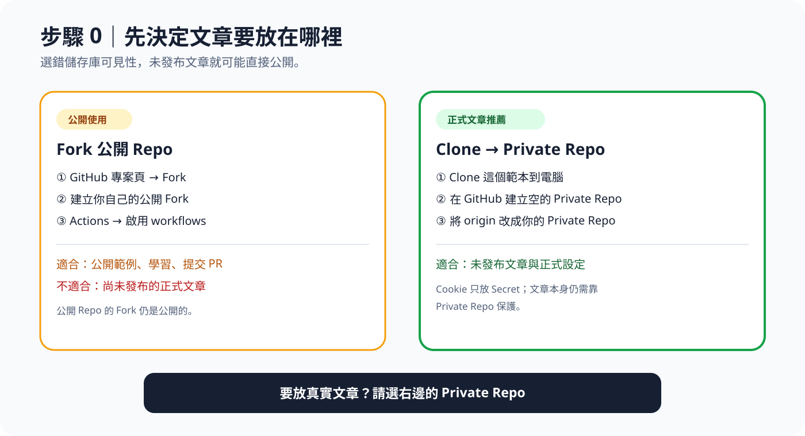

### 方式 A：Fork，適合公開範例

1. 開啟 [iThome-Ironman-AutoPost](https://github.com/eric861129/iThome-Ironman-AutoPost)。
2. 按右上角 **Fork**。
3. 回到你的 Fork，開啟 **Actions**。
4. 若 GitHub 顯示 workflow 尚未啟用，按 **I understand my workflows, go ahead and enable them**。
5. Clone 你的 Fork。

先用檔案總管選一個存放專案的資料夾，點一下上方的路徑列並複製路徑。回到 PowerShell，執行下面的 `Set-Location`。範例使用 `D:\Projects`，請換成你剛才複製的資料夾路徑：

```powershell
Set-Location "D:\Projects"
```

接著執行下面四行。先把 `YOUR_GITHUB_ACCOUNT` 換成你的 GitHub 帳號。例如帳號是 `amy123`，網址就會是 `https://github.com/amy123/iThome-Ironman-AutoPost.git`。

```powershell
git clone https://github.com/YOUR_GITHUB_ACCOUNT/iThome-Ironman-AutoPost.git
Set-Location iThome-Ironman-AutoPost
Get-Location
Test-Path -LiteralPath package.json
```

`git clone` 會下載專案，`Set-Location` 會進入專案資料夾。最後一行應顯示 `True`，代表目前位置正確。後續 PowerShell 指令都要在這個專案資料夾執行。

公開 Repo 的 Fork 仍然是公開的，無法保護尚未發布的文章。另外，GitHub 預設會停用公開 Fork 的 scheduled workflows。全部 UAT 通過後，還要到 **Actions → Publish iThome articles → Enable workflow** 手動啟用。[GitHub Fork 可見性說明](https://docs.github.com/en/pull-requests/reference/forks#about-visibility-of-forks)、[啟用 workflow 說明](https://docs.github.com/en/actions/how-tos/manage-workflow-runs/disable-and-enable-workflows)

### 方式 B：Clone 到 Private Repo，正式連載建議用這個

這個方式會保留原作者的 Repo 作為更新來源，再把文章與設定推送到你自己的 Private Repo。請依序完成下面四個小步驟。

#### 0-B-1：下載公開範本

先切換到要存放專案的資料夾。範例使用 `D:\Projects`，請換成你的實際路徑：

```powershell
Set-Location "D:\Projects"
git clone https://github.com/eric861129/iThome-Ironman-AutoPost.git my-ithome-autopost
Set-Location my-ithome-autopost
Test-Path -LiteralPath package.json
```

最後一行應顯示 `True`。

#### 0-B-2：保留公開範本的更新來源

將原本的 `origin` 改名為 `upstream`：

```powershell
git remote rename origin upstream
```

`upstream` 代表公開範本。未來想取得這個專案的新版本時，會從這裡讀取。

#### 0-B-3：連到自己的 Private Repo

在 GitHub 建立一個**空的 Private Repo**。不要勾選新增 README、`.gitignore` 或 License。建立完成後，將下面的 `YOUR_GITHUB_ACCOUNT` 與 `YOUR_PRIVATE_REPO` 換成自己的資料，再執行指令：

```powershell
git remote add origin https://github.com/YOUR_GITHUB_ACCOUNT/YOUR_PRIVATE_REPO.git
git push -u origin main
```

`origin` 代表你自己的 Repo。第一次執行 `git push` 時，Git 可能會開啟瀏覽器要求登入 GitHub，請使用擁有該 Private Repo 的帳號登入。

#### 0-B-4：確認沒有連錯 Repo

用以下指令確認遠端沒有設反：

```powershell
git remote -v
```

預期結果會有四行，網址依你的帳號與 Repo 名稱而不同：

```text
origin    https://github.com/你的帳號/你的私人Repo.git (fetch)
origin    https://github.com/你的帳號/你的私人Repo.git (push)
upstream  https://github.com/eric861129/iThome-Ironman-AutoPost.git (fetch)
upstream  https://github.com/eric861129/iThome-Ironman-AutoPost.git (push)
```

只要確認 `origin` 指向你的 Repo，`upstream` 指向 `eric861129/iThome-Ironman-AutoPost` 即可。

> [!IMPORTANT]
> GitHub Free 的 Private Repo 無法設定 Environment secrets。這種情況請改用一個 Repository secret，名稱一樣填 `ITHOME_STORAGE_STATE_B64`。GitHub Pro、Team、Enterprise 或公開 Repo 才使用後面介紹的三個 Environment secrets。[GitHub Environments 方案限制](https://docs.github.com/en/actions/how-tos/deploy/configure-and-manage-deployments/manage-environments#who-can-use-this-feature)

### 安裝與確認範本

第一次操作時，請一行一行執行。看到 PowerShell 重新出現 `PS C:\...>` 後，才執行下一行。

1. 安裝專案需要的套件。第一次執行可能需要幾分鐘：

```powershell
npm.cmd ci
```

成功時會回到 PowerShell 提示字元，而且不會出現紅色的 `npm error`。

2. 執行程式檢查與測試：

```powershell
npm.cmd run check
```

成功時，測試摘要的 `fail` 會是 `0`，而且 TypeScript 型別檢查不會出現錯誤。

3. 檢查所有範例文章的檔名、篇數與 Markdown 格式：

```powershell
npm.cmd run validate:all
```

成功時會看到 `PASS` 與文章篇數，例如 `PASS sample-series：30 篇文章`。

4. 用範本內的虛構日期產生 Day 1 計畫：

```powershell
npm.cmd run validate -- --date 2099-09-01 --json
```

成功時會顯示一段 JSON，裡面包含 Day、系列與文章路徑。看得到計畫即可，不需要修改這些範例值。

四個步驟都不會登入或連線 iThome，也不會儲存或發布文章。若某一步出現錯誤，先停在該步，不要繼續執行後面的指令。

## 步驟 1：收集自己的 iThome ID

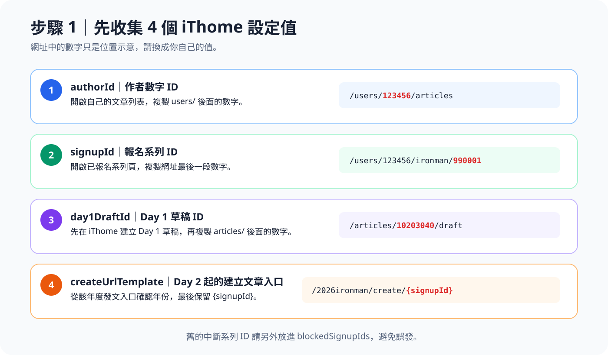

請先準備以下資料：

| 設定值 | 從哪裡取得 | 網址示例 |
| --- | --- | --- |
| `authorId` | 自己的 iThome 文章列表網址 | `/users/123456/articles` 中的 `123456` |
| `signupId` | 已報名系列頁網址最後一段 | `/users/123456/ironman/990001` 中的 `990001` |
| `day1DraftId` | Day 1 草稿網址 | `/articles/10203040/draft` 中的 `10203040` |
| `createUrlTemplate` | 該年度「發表文章」入口 | `https://ithelp.ithome.com.tw/2026ironman/create/{signupId}` |

每個系列都有自己的 `signupId` 與 `day1DraftId`。如果同時發布三個系列，就要準備三組。

`createUrlTemplate` 的年份或路徑必須以當年度 iThome 實際建立文章入口為準，最後一段請保留 `{signupId}`，不要填成固定數字。

舊的、中斷的，或確定不能再使用的系列 ID，都要放進 `blockedSignupIds`。萬一之後填錯 `signupId`，程式會直接停止，避免文章誤發到舊系列。

## 步驟 2：放入 Markdown 文章

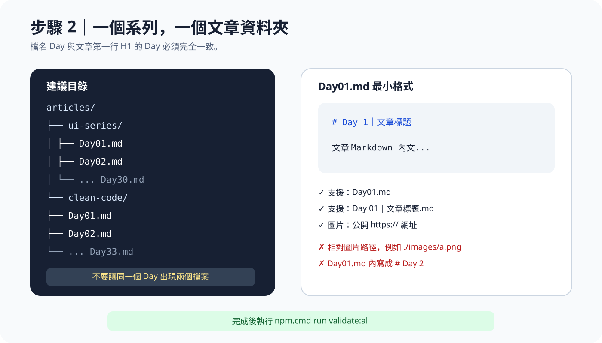

每個系列建立一個獨立資料夾：

```text
articles/
├── ui-series/
│   ├── Day01.md
│   ├── Day02.md
│   └── ... Day30.md
├── web-series/
│   ├── Day01.md
│   └── ... Day30.md
└── clean-code/
    ├── Day01.md
    └── ... Day33.md
```

每篇文章至少要有一個 H1 標題與正文：

```markdown
# Day 1｜文章標題

文章 Markdown 內文。
```

支援的檔名：

```text
Day01.md
Day 01｜文章標題.md
```

規則：

- 每個 Day 只能有一個 Markdown 檔案。
- 檔名 Day 與第一行 H1 Day 必須一致。
- H1 後面必須有正文。
- 圖片必須是公開的 `https://` 網址；相對路徑會讓驗證失敗。
- 範例 `articles/sample-series` 可以保留，只要 `config/series.yml` 沒有引用它就不會發布。

### 圖片與圖床

這個專案只處理文章發布，不會幫你上傳圖片。文章內的圖片可以先用 [Cloud-Assets-Template](https://github.com/eric861129/Cloud-Assets-Template) 轉成 WebP，再改用 jsDelivr 網址。

開發預覽可以暫時指向 branch：

```text
https://cdn.jsdelivr.net/gh/<帳號>/<圖床Repo>@main/<圖片路徑>.webp
```

正式文章建議固定到 Git tag：

```text
https://cdn.jsdelivr.net/gh/<帳號>/<圖床Repo>@v1.0.0/<圖片路徑>.webp
```

也可以固定到 commit SHA：

```text
https://cdn.jsdelivr.net/gh/<帳號>/<圖床Repo>@<commit-sha>/<圖片路徑>.webp
```

`@main` 會跟著分支內容變動，不適合當作已發布文章的長期圖片網址。

## 步驟 3：設定 config/series.yml

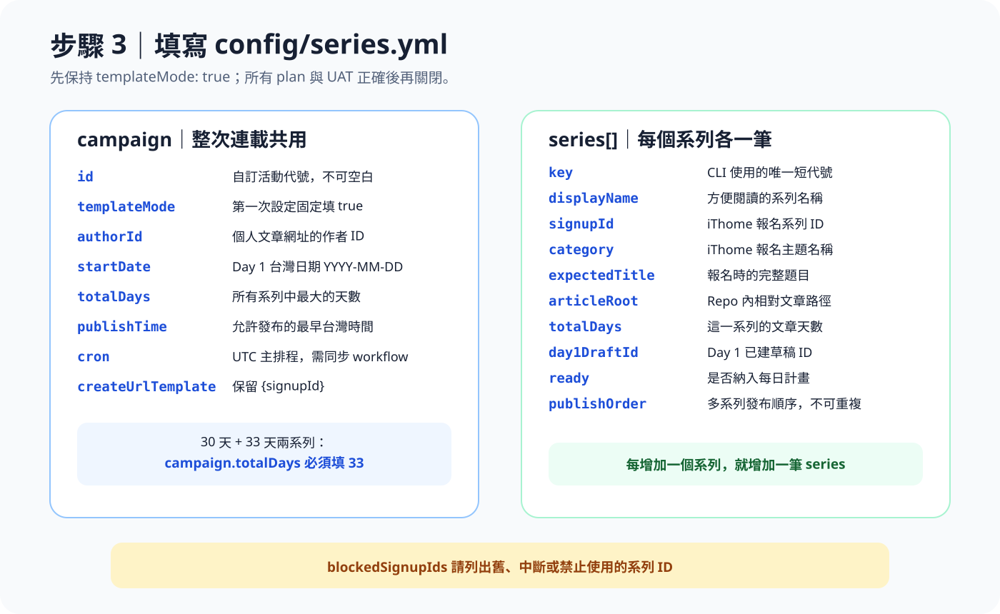

編輯 [config/series.yml](config/series.yml)。第一次設定時，`templateMode` 必須保持 `true`：

```yaml
campaign:
  id: my-ironman-campaign
  templateMode: true
  authorId: 123456
  startDate: "2026-09-01"
  totalDays: 33
  timeZone: Asia/Taipei
  publishTime: "06:00"
  cron: "7 22 * * *"
  createUrlTemplate: "https://ithelp.ithome.com.tw/2026ironman/create/{signupId}"

blockedSignupIds:
  - 8001
  - 8002

series:
  - key: ui-series
    displayName: UI 系列
    signupId: 9101
    category: Vibe Coding
    expectedTitle: "請填入 iThome 報名時的完整系列題目"
    articleRoot: articles/ui-series
    totalDays: 30
    day1DraftId: 10203001
    ready: true
    publishOrder: 1

  - key: clean-code
    displayName: Clean Code 系列
    signupId: 9102
    category: Software Development
    expectedTitle: "請填入第二個系列的完整題目"
    articleRoot: articles/clean-code
    totalDays: 33
    day1DraftId: 10203002
    ready: true
    publishOrder: 2
```

### campaign 欄位

| 欄位 | 要填什麼 |
| --- | --- |
| `id` | 自訂且非空白的活動代號，例如 `my-ironman-2026` |
| `templateMode` | 初次設定填 `true`；完成 plan 後才改成 `false` |
| `authorId` | iThome 個人文章網址中的作者數字 ID |
| `startDate` | Day 1 的台灣日期，格式 `YYYY-MM-DD` |
| `totalDays` | 所有系列中最大的天數；30 天與 33 天並存時填 `33` |
| `timeZone` | 目前固定支援 `Asia/Taipei` |
| `publishTime` | 台灣當天允許正式發布的最早時間，格式 `HH:mm` |
| `cron` | 主排程的 UTC Cron，必須與 `publish.yml` 同步 |
| `createUrlTemplate` | 當年度建立文章網址，必須保留 `{signupId}` |

### series 欄位

| 欄位 | 要填什麼 |
| --- | --- |
| `key` | CLI 與 Actions 使用的唯一短代號，建議只使用英數字與連字號，最不容易遇到解析問題 |
| `displayName` | 方便閱讀的系列名稱 |
| `signupId` | 這一個報名系列的 ID |
| `category` | iThome 報名主題名稱，例如 `Modern Web` |
| `expectedTitle` | iThome 顯示的完整系列題目，會用來防止選錯系列 |
| `articleRoot` | 儲存庫內相對路徑，不能填 Windows 絕對路徑 |
| `totalDays` | 該系列實際文章數，例如 `30` 或 `33` |
| `day1DraftId` | 該系列 Day 1 已建立草稿的文章 ID |
| `ready` | `true` 會納入計畫；需要暫停單一系列時改成 `false` |
| `publishOrder` | 多系列處理順序，必須是不可重複的正整數 |

要增加第三個系列，只要複製一整筆 `series`，再換掉 `key`、ID、題目、路徑與順序。如果某個系列比較短，發布完最後一天後就會自動略過，不用建立空白檔案補天數。

## 步驟 4：驗證文章與每日計畫

這一段指令中的日期與系列名稱只是範例，請先看懂要替換的位置：

| 範例內容 | 要換成什麼 |
| --- | --- |
| `2026-09-01` | `config/series.yml` 裡的 `startDate`，也就是第一天發布日期 |
| `ui-series` | 要檢查的 `series.key`；有三個系列就分別執行三次 |
| `--plan` | 只顯示預計執行內容，不啟動瀏覽器、不登入、不儲存、不發布 |

先執行完整檢查：

```powershell
npm.cmd run check
npm.cmd run validate:all
npm.cmd run validate -- --date 2026-09-01 --json
```

再替每個系列檢查三種計畫。下面以 `2026-09-01` 和 `ui-series` 示範，請換成你自己的 `startDate` 與 `series.key`：

```powershell
npm.cmd run preview -- --date 2026-09-01 --series ui-series --plan --json
npm.cmd run save-draft -- --date 2026-09-01 --series ui-series --plan --json
npm.cmd run publish -- --date 2026-09-01 --series ui-series --plan --json
```

逐一確認輸出內容：

- Day 是否等於 1。
- `seriesKey` 是否正確。
- Day 1 是否使用 `/articles/<day1DraftId>/draft`。
- Day 2 起的 `createUrl` 是否包含正確 `signupId`。
- 文章標題、系列完整題目、作者文章頁及 RSS 網址是否正確。
- 舊的 `blockedSignupIds` 沒有出現在任何 target。

`templateMode: true` 時，就算執行 Preview、Save draft 或 Publish，也會在開啟瀏覽器、讀取 Session 或連線 iThome 前停止。這是刻意保留的安全閘門。

## 步驟 5：建立 iThome 登入狀態

這個專案只負責讀取登入狀態，不會取得帳號密碼，也不會代替你登入 iThome。第一次設定時，你要在 Playwright 開啟的瀏覽器中人工登入一次。

登入狀態會按照下面的順序進入 GitHub Actions：

| 誰負責 | 做什麼 |
| --- | --- |
| 你 | 在 Playwright 開啟的 Chromium 中人工登入 iThome |
| Playwright CLI | 結束操作時，把這次瀏覽器的 Cookie 與網站儲存空間輸出成 storage state JSON |
| PowerShell | 將 JSON 轉成方便貼入 GitHub Secret 的 Base64 文字 |
| GitHub Actions | 執行時讀取 Secret，把 Base64 還原成暫存 JSON |
| 專案內的 TypeScript 程式 | 用還原後的 JSON 建立瀏覽器 context，直接沿用已登入狀態 |

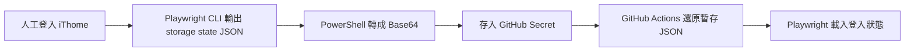

專案已經寫好讀取及還原登入狀態的程式。第一次設定及 Session 過期時，仍要重新人工登入。

storage state 內含登入 Cookie 與網站儲存空間，必須當成密碼保管。Session 尚未過期時，拿到檔案的人可能以你的身分登入 iThome。檔案只能放在電腦的安全路徑或 GitHub Secret，禁止 commit、貼到 Issue、上傳 artifact 或輸出到 log。

### 5-1：讓 Playwright 儲存登入狀態

先安裝 Playwright Chromium：

```powershell
npx.cmd playwright install chromium
```

第一次執行會下載 Chromium，可能需要幾分鐘。下載完成並重新看到 `PS C:\...>` 後，再執行下一段；如果畫面仍持續顯示下載進度，請先等待。

看到 PowerShell 重新出現 `PS C:\...>` 後，再執行下一段。下面四行可以整段複製並貼到同一個 PowerShell 視窗：

```powershell
$storageDirectory = Join-Path $env:LOCALAPPDATA "iThome-Ironman-AutoPost"
$storagePath = Join-Path $storageDirectory "ithome-storage-state.json"

New-Item -ItemType Directory -Path $storageDirectory -Force | Out-Null
npx.cmd playwright codegen --save-storage="$storagePath" https://ithelp.ithome.com.tw/
```

- `$storageDirectory` 是存放登入狀態的資料夾。
- `$storagePath` 是登入狀態 JSON 的完整路徑。
- 這兩個變數只在目前的 PowerShell 視窗有效。若不小心關閉視窗，重新執行上面的程式碼區塊即可。
- storage state 會放在目前 Windows 使用者的 `LocalAppData`，不會進入 Git 專案。

這裡執行的是 Playwright 內建的 `codegen` 工具，專案本身沒有另外實作登入程式：

1. Playwright 會開啟一個新的 Chromium 視窗，並可能同時顯示 Playwright Inspector。
2. 在 Chromium 視窗中正常登入 iThome。帳號、密碼與驗證碼都只輸入在 iThome 頁面。
3. 登入後，確認頁面上看得到 **鐵人發文** 按鈕、訊息與通知圖示。
4. 完成登入後，關閉 Chromium 與 Inspector，讓 `codegen` 正常結束。指令結束時，`--save-storage` 會把這次瀏覽器 context 的 storage state 寫入 `$storagePath`。

Chromium 開啟期間，PowerShell 沒有重新顯示 `PS C:\...>` 是正常現象，代表 `codegen` 還在執行。登入只在 Chromium 完成；不需要在 Inspector 輸入、錄製或複製任何程式碼。關閉 Chromium 與 Inspector、PowerShell 重新顯示提示字元後，才能繼續下面的檢查。

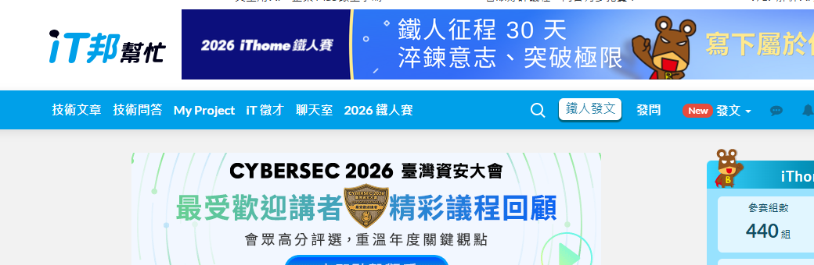

上圖已裁掉帳號名稱與頭像。這一步只會用到 `ithome-storage-state.json`；不必開啟開發者工具抄 Cookie，也可以忽略 Inspector 產生的操作程式碼。

瀏覽器關閉、指令結束後，用下面三行確認檔案存在而且是有效 JSON。這段檢查不會印出 Cookie 內容：

```powershell
Test-Path -LiteralPath $storagePath
(Get-Item -LiteralPath $storagePath).Length
Get-Content -LiteralPath $storagePath -Raw -Encoding UTF8 | ConvertFrom-Json | Out-Null
```

第一行應顯示 `True`，第二行應大於 `0`，第三行不應出現錯誤。如果檔案不存在，先確認 `codegen` 已經結束，再檢查 `$storagePath` 是否指向正確位置。

預期畫面類似：

```text
True
12345
PS C:\你的專案路徑>
```

第三行檢查成功時不會顯示「成功」文字，而是直接回到 `PS C:\...>`。上面的 `12345` 只是範例，只要實際數字大於 `0` 即可。

如果想確認檔案放在哪裡，可以執行：

```powershell
Invoke-Item -LiteralPath $storageDirectory
```

這會用檔案總管開啟資料夾。只要確認 `ithome-storage-state.json` 存在即可，不要開啟、截圖或分享檔案內容。

### 5-2：把 storage state 轉成 Base64

GitHub Secret 接收的是單行文字，所以要先把 JSON 檔案轉成 Base64：

```powershell
$storagePath = Join-Path $env:LOCALAPPDATA "iThome-Ironman-AutoPost\ithome-storage-state.json"
$storageBase64 = [Convert]::ToBase64String(
  [IO.File]::ReadAllBytes($storagePath)
)
$storageBase64 | Set-Clipboard
Write-Host "已將 storage state 的 Base64 複製到剪貼簿。"
Remove-Variable storageBase64
```

`Set-Clipboard` 會把完整 Base64 放進剪貼簿，不會在終端機顯示內容。GitHub Secret 的 Value 要貼上剪貼簿中的 Base64；不要貼檔案路徑或原始 JSON。

看到「已將 storage state 的 Base64 複製到剪貼簿」後，不需要尋找剪貼簿檔案。直接切換到 GitHub Secret 的 `Value` 欄位，按 `Ctrl + V` 貼上即可。Base64 通常很長，這是正常現象。

> [!WARNING]
> Base64 只有編碼效果，任何拿到內容的人都能還原。請只貼到 GitHub Secret，不要貼到聊天、Issue、README 或 Actions log。

Secret 儲存完成後，回到 PowerShell 執行下面這行，用普通文字覆蓋剪貼簿中的登入狀態：

```powershell
Set-Clipboard -Value "ITHOME_STORAGE_STATE_B64 已設定完成"
```

### 5-3：GitHub Pro、Team、Enterprise 或公開 Repo

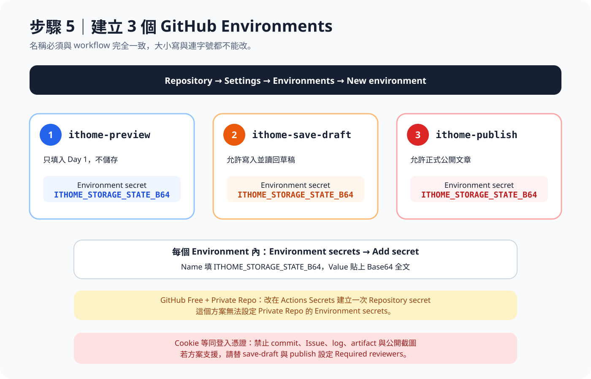

先到 Repository 的 **Settings**，在左側選單找到 **Environments**，再按 **New environment**。下圖使用 `ithome-preview` 示範；建立完成後，再用相同步驟建立 `ithome-save-draft` 與 `ithome-publish`。

**1. 找到 Environments**

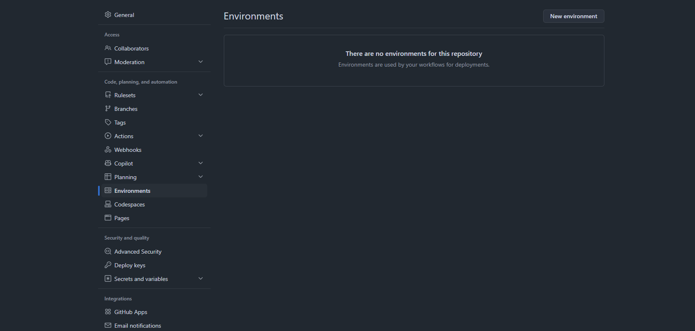

**2. 輸入 Environment 名稱**

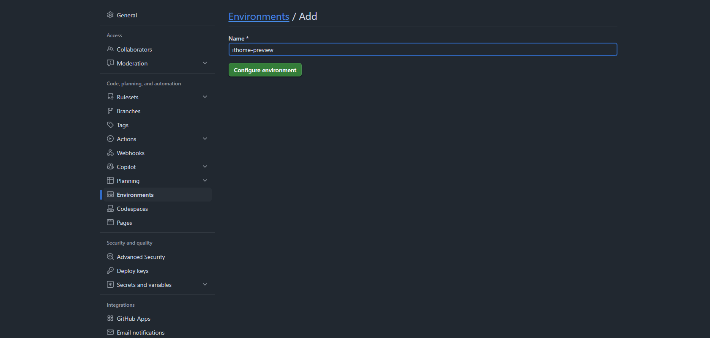

用相同步驟建立以下三個 Environment：

1. `ithome-preview`
2. `ithome-save-draft`
3. `ithome-publish`

在每個 Environment 的 **Environment secrets → Add secret** 新增：

| 欄位 | 內容 |
| --- | --- |
| Name | `ITHOME_STORAGE_STATE_B64` |
| Secret | 剛才複製的 Base64 全文 |

如果 GitHub 方案支援，建議替 `ithome-save-draft` 與 `ithome-publish` 加上 Required reviewers。審核通過後，workflow 才能讀取該 Environment 的 Secret。[GitHub Environments 官方說明](https://docs.github.com/en/actions/reference/workflows-and-actions/deployments-and-environments)

### 5-4：GitHub Free 的 Private Repo

開啟 **Settings → Secrets and variables → Actions → Secrets → New repository secret**，只需建立一次：

**1. 找到 Repository secrets**

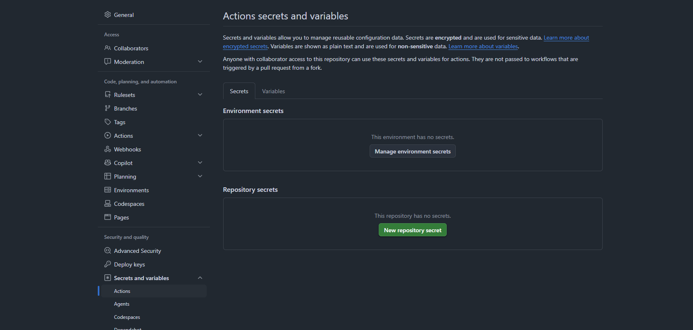

**2. 填入 Secret 名稱與內容**

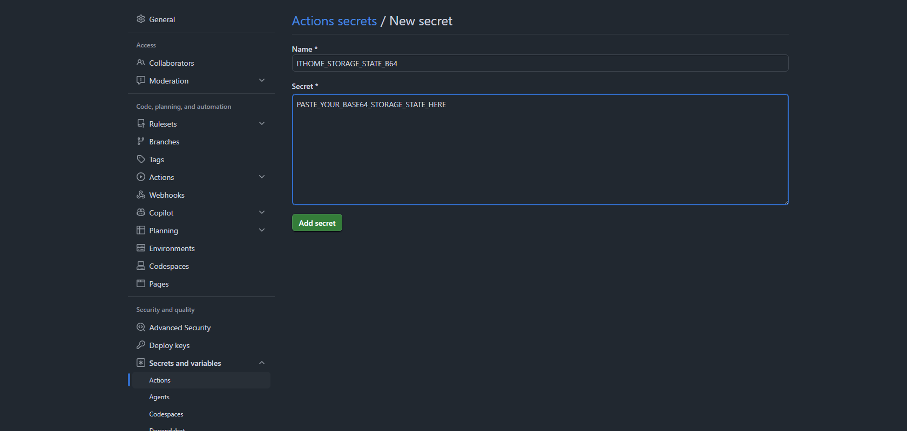

截圖中的 `PASTE_YOUR_BASE64_STORAGE_STATE_HERE` 只是假資料。實際設定時，請在 Secret 欄位貼上前一步產生的完整 Base64；不要讓真正內容出現在截圖、README、Issue 或 Actions log。

| 欄位 | 內容 |
| --- | --- |
| Name | `ITHOME_STORAGE_STATE_B64` |
| Secret | 剛才複製的 Base64 全文 |

三個 workflow 讀取的都是 `secrets.ITHOME_STORAGE_STATE_B64`，所以一份 Repository secret 就夠了。Private Repo 的 GitHub Free 無法使用 Environment protection rules，正式發布前要更謹慎執行手動 UAT。

### 5-5：GitHub Actions 怎麼使用這個 Secret

Preview、Save draft 與 Publish workflow 都已經寫好還原流程。Actions 執行時會：

1. 從 `secrets.ITHOME_STORAGE_STATE_B64` 取得 Base64。
2. 在 GitHub Runner 的暫存資料夾還原成 `ithome-storage-state.json`。
3. 將暫存檔路徑傳給 CLI 的 `--storage-state`。
4. TypeScript 程式用 `browser.newContext({ storageState: ... })` 建立瀏覽器 context。
5. Playwright 開啟 iThome 時，瀏覽器就會帶著原本的登入狀態。

三個 workflow 使用的還原內容如下：

```yaml
- name: Restore iThome login state
  env:
    ITHOME_STORAGE_STATE_B64: ${{ secrets.ITHOME_STORAGE_STATE_B64 }}
  run: |
    test -n "$ITHOME_STORAGE_STATE_B64"
    printf '%s' "$ITHOME_STORAGE_STATE_B64" | base64 --decode > "$RUNNER_TEMP/ithome-storage-state.json"
```

還原完成後，workflow 會把路徑傳給現有 CLI：

```text
--storage-state "$RUNNER_TEMP/ithome-storage-state.json"
```

還原後的 JSON 只會放在該次 GitHub Actions Runner 的暫存資料夾，不會被 commit 回 Repo。iThome Session 過期後，workflow 會因未登入而失敗。此時重新執行本步驟，再用新的 Base64 覆蓋同名 Secret。

## 步驟 6：推送設定並確認 GitHub Actions

以下指令都要在專案資料夾執行。如果不確定目前位置，先執行：

```powershell
Get-Location
Test-Path -LiteralPath package.json
```

第二行顯示 `True` 才繼續。

### 6-1：先檢查準備提交的內容

確認沒有把 storage state、`.env` 或其他敏感檔案加入 Git：

```powershell
git status --short
git diff -- config/series.yml
```

`git status --short` 會列出修改過的檔案。這時應該只看到你準備發布的設定與文章；如果看到 `ithome-storage-state.json`、`.env` 或不認識的檔案，先不要執行 `git add`。

### 6-2：只加入設定與文章

```powershell
git add config/series.yml articles
git status --short
```

`git add` 只是把指定檔案放進這次的提交清單，還沒有上傳到 GitHub。再次執行 `git status --short`，確認清單裡只有 `config/series.yml` 與 `articles` 底下的文章。

### 6-3：建立 Commit

```powershell
git commit -m "config: add my ithome series"
```

`git commit` 會把這次修改記錄在本機。成功時會看到類似 `[main abc1234] config: add my ithome series` 的訊息。

如果出現 `Author identity unknown`，先在目前專案設定提交者名稱與 GitHub Email，再重新執行 `git commit`：

```powershell
git config user.name "你的名稱"
git config user.email "你在 GitHub 使用的 Email"
```

### 6-4：推送到 GitHub

```powershell
git push
```

`git push` 才會把本機 Commit 上傳到 GitHub。第一次執行時，Git 可能會開啟瀏覽器要求登入。請使用擁有這個 Repo 的 GitHub 帳號登入。

成功時會看到類似 `main -> main` 的訊息。如果出現 `403` 或 `Authentication failed`，代表目前 GitHub 帳號沒有該 Repo 的寫入權限。請先確認登入帳號與 Repo 擁有者，再重新執行 `git push`；不要把帳號密碼或 Token 直接寫進遠端網址。

開啟 GitHub Repo 的 **Actions**，確認 **Validate iThome AutoPost** 成功。若 Actions 未啟用，先到 **Actions** 頁面啟用 workflows。

此時仍不要建立 `ITHOME_PUBLISH_ENABLED`。

## 步驟 7：依序完成三階段 UAT

完成所有 `--plan` 後，將 `config/series.yml` 改成：

```yaml
campaign:
  templateMode: false
```

再次執行 `npm.cmd run check` 與 `npm.cmd run validate:all`，提交並推送到 `main`。

GitHub Actions 是建議的主要操作方式。下面的「本機命令」是選用功能，適合需要在自己電腦上看著瀏覽器操作的人。執行本機命令前，先切換到專案資料夾並確認位置：

```powershell
Set-Location "D:\你的專案路徑\iThome-Ironman-AutoPost"
Test-Path -LiteralPath package.json
```

請把路徑換成自己的實際位置。第二行顯示 `True` 才能繼續。每個本機命令中的 `2026-09-01` 都要換成要測試的台灣日期，`ui-series` 則要換成 `config/series.yml` 裡的 `series.key`。

### UAT 1：Preview，只填入、不儲存

> [!NOTE]
> Preview 會開啟瀏覽器並把標題與內文填入表單，但不會按下儲存或發布。第一次測試請從這裡開始。

開啟 **Actions → Preview iThome Day 1 draft → Run workflow**：

| 輸入欄位 | 第一次建議值 |
| --- | --- |
| `preview_date` | `startDate`，例如 `2026-09-01` |
| `series` | 先填一個 `series.key`，例如 `ui-series` |

先確認畫面或 artifact 顯示標題與 Markdown 已正確填入，而且 iThome 草稿沒有被儲存。第一個系列確認沒問題後，再逐一測試其他系列；第一次不要直接選 `all`。

本機也可以用 headed 模式測試。按下 Enter 後會開啟瀏覽器；檢查完成後關閉瀏覽器即可：

```powershell
npm.cmd run preview -- --date 2026-09-01 --series ui-series --storage-state "$env:LOCALAPPDATA\iThome-Ironman-AutoPost\ithome-storage-state.json" --headed --json
```

### UAT 2：Save draft，儲存後讀回

> [!WARNING]
> Save draft 會真的儲存並覆寫 iThome 草稿。請先確認 Preview 的標題、系列與內文全部正確。

開啟 **Actions → Save iThome draft → Run workflow**：

| 輸入欄位 | 值 |
| --- | --- |
| `publication_date` | 要儲存的台灣日期 |
| `series` | 先填單一 `series.key` |
| `confirm_save` | `SAVE_DRAFT` |

確認 iThome 草稿已儲存，重新開啟後的標題與 Markdown 正文一致。

本機命令按下 Enter 後會開啟瀏覽器，並將內容儲存到指定系列的草稿：

```powershell
npm.cmd run save-draft -- --date 2026-09-01 --series ui-series --storage-state "$env:LOCALAPPDATA\iThome-Ironman-AutoPost\ithome-storage-state.json" --confirm SAVE_DRAFT --headed --json
```

### UAT 3：手動 Publish，正式公開一篇

> [!CAUTION]
> Publish 會把文章正式公開。本專案無法自動復原公開操作；內容有誤時，必須回到 iThome 手動修改。

正式 Publish 只接受台灣當天，而且不得早於 `publishTime`。開啟 **Actions → Publish iThome articles → Run workflow**：

| 輸入欄位 | 值 |
| --- | --- |
| `publication_date` | 執行當天的台灣日期 |
| `series` | 先填單一 `series.key` |
| `confirm_publish` | `PUBLISH` |

先發布一個系列，確認以下三處都正確後，再測試其他系列：

1. iThome 公開文章頁。
2. 作者文章列表。
3. `https://ithelp.ithome.com.tw/rss/series/<signupId>`。

GitHub Actions 顯示 Success 只能證明 workflow 執行完成；公開文章頁與系列 RSS 才是發布事實。RSS 有時會比公開頁晚更新，此時先看 receipt 與作者文章列表，不要立即重跑。

本機命令只接受台灣當天，而且必須已經到達 `publishTime`。請再次確認日期、`series.key` 與文章內容，再按下 Enter：

```powershell
npm.cmd run publish -- --date 2026-09-01 --series ui-series --storage-state "$env:LOCALAPPDATA\iThome-Ironman-AutoPost\ithome-storage-state.json" --confirm PUBLISH --headed --json
```

這套自動化沒有提供 rollback。文章一旦公開，如果內容有誤，必須回到 iThome 手動修改。

## 步驟 8：最後才啟用每日排程

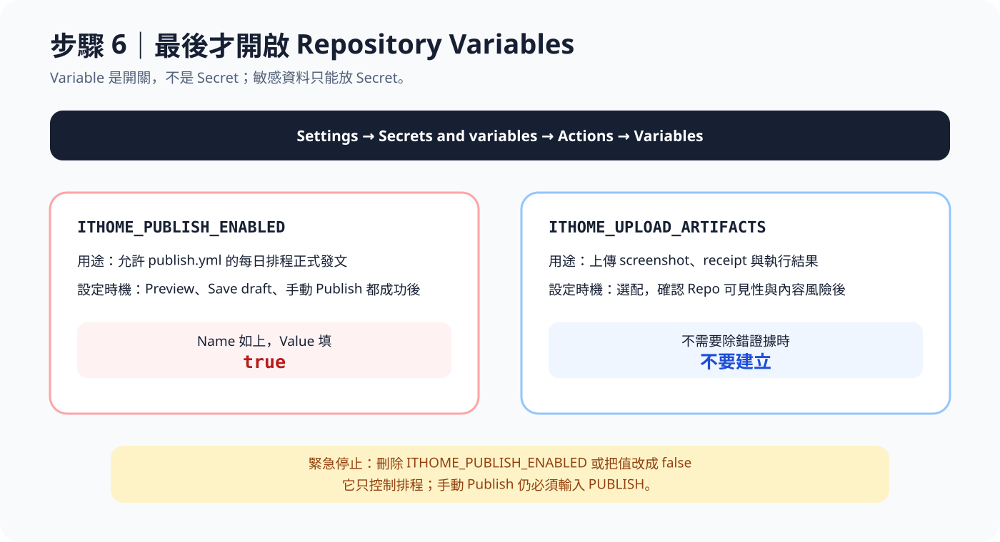

手動 Publish UAT 通過後，才能建立 `ITHOME_PUBLISH_ENABLED`。下圖只示範欄位怎麼填，沒有按下 **Add variable**。

**1. 切換到 Variables**


**2. 填入啟用變數**

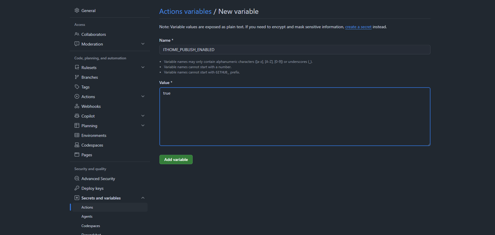

所有系列都完成手動 Publish UAT 後，開啟：

**Settings → Secrets and variables → Actions → Variables → New repository variable**

新增：

| Name | Value | 用途 |
| --- | --- | --- |
| `ITHOME_PUBLISH_ENABLED` | `true` | 允許每日 scheduled workflow 正式發文 |
| `ITHOME_UPLOAD_ARTIFACTS` | `true` | 選配；上傳 screenshot、receipt 與結果 JSON |

`ITHOME_UPLOAD_ARTIFACTS` 可能讓未發布文章內容出現在 Actions artifacts。沒有明確需求時不要建立。

手動 Publish 仍必須輸入 `PUBLISH`。`templateMode: false`、確認字串、Secret、Environment 與 `ITHOME_PUBLISH_ENABLED` 是不同的安全閘門，彼此不能取代。

### 預設排程時間

目前 [.github/workflows/publish.yml](.github/workflows/publish.yml) 設定：

| 台灣時間 | UTC Cron | 用途 |
| --- | --- | --- |
| 每日 06:07 | `7 22 * * *` | 主排程 |
| 每日 06:22 | `22 22 * * *` | 補償排程；會先檢查公開結果，避免重複發布 |

`config/series.yml` 裡的 `publishTime: "06:00"` 代表最早允許發布的時間。真正啟動排程的時間，則由 `publish.yml` 的 `schedule` 決定。要調整時間時，下面三個地方必須一起修改：

1. `campaign.publishTime`。
2. `campaign.cron`。
3. `publish.yml` 的主排程與補償排程。

GitHub Actions Cron 以 UTC 執行，而且排程可能延遲。Scheduled workflow 只會在 default branch 執行。公開 Repo 連續 60 天沒有活動時，GitHub 也可能自動停用排程。[GitHub schedule 官方說明](https://docs.github.com/en/actions/reference/workflows-and-actions/events-that-trigger-workflows#schedule)

## 完成設定檢查表

- [ ] 真實文章位於 Private Repo，或我確定文章可以公開。
- [ ] `authorId`、每個 `signupId` 與 `day1DraftId` 都來自自己的 iThome 網址。
- [ ] `blockedSignupIds` 包含所有舊系列與中斷系列 ID。
- [ ] `campaign.totalDays` 等於最長系列天數。
- [ ] 每個 `articleRoot` 都是 Repo 相對路徑。
- [ ] `npm.cmd run check` 通過。
- [ ] `npm.cmd run validate:all` 通過。
- [ ] 每個系列的 Preview、Save draft、Publish `--plan` 都正確。
- [ ] storage state 沒有出現在 Git、Issue、log 或 artifact。
- [ ] GitHub Secret 名稱是 `ITHOME_STORAGE_STATE_B64`。
- [ ] `templateMode: false` 前，所有範例 ID 與範例網址都已替換。
- [ ] 每個系列都完成單獨 Preview。
- [ ] 每個系列都完成單獨 Save draft 並讀回驗證。
- [ ] 至少完成一次手動 Publish，公開頁、文章列表與 RSS 都正確。
- [ ] 最後才建立 `ITHOME_PUBLISH_ENABLED=true`。

## 常見問題

### PowerShell 找不到 `git`、`node`、`npm.cmd` 或 `npx.cmd`

如果看到「無法將名稱辨識為 Cmdlet、函式、指令碼檔案或可執行程式」，代表工具尚未安裝，或 PowerShell 還沒有讀到安裝後的新設定。

1. 安裝 [Git](https://git-scm.com/download/win) 與 [Node.js 24](https://nodejs.org/) 或更新版本。
2. 關閉所有 PowerShell 視窗。
3. 重新開啟 PowerShell。
4. 執行 `git --version`、`node --version` 與 `npm.cmd --version`。

三行都顯示版本號後，再回到專案步驟。

### 顯示找不到 `package.json`

這通常代表 PowerShell 不在專案資料夾。執行下面兩行確認：

```powershell
Get-Location
Get-ChildItem -Name
```

正確的資料夾裡應該看得到 `package.json`、`README.md`、`articles` 與 `config`。如果看不到，使用 `Set-Location` 切換到專案資料夾：

```powershell
Set-Location "D:\你的專案路徑\iThome-Ironman-AutoPost"
```

請把範例路徑換成自己的實際位置。

### 指令執行後一直沒有回到 `PS C:\...>`

- 如果剛執行 Playwright 指令，而且 Chromium 或 Inspector 還開著，代表程式仍在執行。完成操作並關閉這兩個視窗即可。
- 如果正在執行 `npm.cmd ci` 或測試，先看終端機是否仍持續出現新訊息。第一次安裝可能需要幾分鐘。
- 只有確定程式沒有繼續執行時，才按 `Ctrl + C` 中止。不要在 Publish 正在儲存或發布文章時任意中止。

### 貼上指令後出現奇怪的語法錯誤

只複製程式碼區塊裡的指令，不要一起複製以下內容：

- `PS C:\Users\...>` 這類提示字元。
- 文件左側的行號。
- 程式碼區塊前後的三個反引號。
- 指令後方的說明文字。

路徑裡如果有空白，必須保留雙引號，例如：

```powershell
Set-Location "D:\My Projects\iThome-Ironman-AutoPost"
```

### 不小心關閉 PowerShell，還能繼續嗎？

可以。重新開啟 PowerShell，切換回專案資料夾，再從尚未完成的步驟繼續：

```powershell
Set-Location "D:\你的專案路徑\iThome-Ironman-AutoPost"
Test-Path -LiteralPath package.json
```

第二行顯示 `True` 代表位置正確。PowerShell 變數會在關閉視窗後消失；如果後續指令需要 `$storagePath` 或 `$storageDirectory`，重新執行步驟 5-1 中建立變數的兩行即可。登入狀態 JSON 不會因為關閉 PowerShell 而消失。

### `git push` 顯示 `403` 或 `Authentication failed`

目前登入的 GitHub 帳號沒有 Repo 寫入權限。請確認瀏覽器登入的是 Repo 擁有者或 Collaborator 帳號，再重新執行：

```powershell
git push
```

不要把 GitHub 密碼、Personal Access Token 或其他憑證直接寫進 Git 遠端網址。

### Workflow 顯示 skipped，沒有執行

先看是哪一種 workflow：

- Publish 排程：確認 `ITHOME_PUBLISH_ENABLED` 的值是小寫 `true`。
- 手動 Save draft：確認輸入完全等於 `SAVE_DRAFT`。
- 手動 Publish：確認輸入完全等於 `PUBLISH`。
- 所有 workflow：確認執行分支是 `main`。

### Preflight 顯示仍是公開範本

`templateMode` 仍為 `true`，或設定還含有公開範例值。不要繞過 preflight；先完成 ID、文章、網址與 plan 檢查，再改成 `false`。

### 找不到 `ITHOME_STORAGE_STATE_B64`

- Environment 方案：確認三個 Environment 名稱完全正確，而且每個都建立同名 Secret。
- GitHub Free Private Repo：確認 Secret 建立在 **Settings → Secrets and variables → Actions → Secrets**，不是 Variables。
- Secret 內容必須是完整 Base64，不能只貼 storage state 的檔案路徑。

### iThome 顯示未登入

Session 已過期。重新執行 Playwright codegen、人工登入、產生 Base64，再更新 GitHub Secret。不要把帳號密碼寫進 workflow。

### 排程時間到了卻沒有發文

依序檢查：

1. **Actions → Publish iThome articles** 是否為 Enabled。
2. `ITHOME_PUBLISH_ENABLED` 是否存在且等於 `true`。
3. `publish.yml` 是否位於 default branch。
4. workflow run 是 skipped、failed，還是仍在 queue。
5. 公開文章頁、作者文章列表與系列 RSS 是否已出現文章。

GitHub Actions 排程不是精準鬧鐘，延遲不代表程式一定失敗。

### 需要立刻停止自動發布

- 全部停止：刪除 `ITHOME_PUBLISH_ENABLED`，或把值改成 `false`。
- 暫停單一系列：將該系列 `ready` 改成 `false`，提交並推送。
- Session 洩漏：立刻在 iThome 登出所有工作階段，重新產生 storage state。
- DOM 或表單驗證失敗：保持排程關閉，用 headed 模式檢查網站是否改版。

## 安全預設如何運作

公開版本的 [config/series.yml](config/series.yml) 使用虛構 ID，並預設 `templateMode: true`。`templateMode` 還是 `true` 時：

- 測試、型別檢查、文章驗證與 `--plan` 可以執行。
- Preview、Save draft、Publish 都會在啟動瀏覽器、讀取 Session 或連線 iThome 前停止。
- GitHub Actions 也會先執行相同 preflight。

另外還有這些防誤發機制：

- Day 1 會沿用已知草稿；從 Day 2 起，才會透過指定系列的發文入口建立文章。
- 系列完整題目、category、作者、Day 與文章內容會交叉驗證。
- 系列 RSS、作者文章列表與 receipt 用來避免補償排程重複發文。
- Save draft 會重新開啟草稿，確認標題與 Markdown 正文一致。
- Publish 會先儲存與讀回，再正式發布並驗證公開頁。
- 多系列依 `publishOrder` 依序處理；前一系列發生重大錯誤時，後續系列停止。

## 專案結構

```text
articles/                   Markdown 文章
config/series.yml           活動與系列白名單
src/                        驗證、計畫與 Playwright 自動化
tests/                      單元、安全與 workflow 測試
.github/workflows/          GitHub Actions
docs/images/quick-start/    README 操作圖解
docs/adr/                   穩定的架構決策
docs/project-introduction-article.md
```

安全設計理由請看 [ADR-0001](docs/adr/0001-gated-ithome-publication.md)。漏洞回報方式請看 [SECURITY.md](SECURITY.md)。

## 限制

- 發文流程依賴 iThome 網頁 UI。因為沒有官方發文 API，只要網站改版，自動化腳本就可能需要跟著調整。
- 目前只支援 `Asia/Taipei`。
- Day 1 必須先手動建立草稿。
- GitHub Actions 排程可能延遲或被停用。
- GitHub Free Private Repo 無法使用 Environment protection rules。
- 公開文章無法自動 rollback。

## 授權與貢獻

本專案採用 [MIT License](LICENSE)，歡迎提交 Issue 或 Pull Request。提交公開內容前，請再次確認沒有附上 Cookie、storage state、Session、尚未發布的文章或其他敏感資料。
