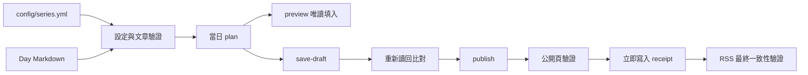

# iThome Ironman AutoPost 開源版設計

## 狀態

設計已核准，並作為開源範本的需求與驗收邊界。

## 背景

既有的 `All-Draft` 儲存庫已能用 TypeScript、Playwright 與 GitHub Actions 驗證、預覽、儲存及發布 iThome 鐵人賽文章。該儲存庫同時包含 93 篇個人文章、真實系列與作者識別值、活動日期、草稿識別值及正式排程，不能直接當成公開範本。

新的 `iThome-Ironman-AutoPost` 儲存庫要提供一套可分享、可驗證且預設不會寫入 iThome 的 Starter Template。使用者必須完成自己的設定與安全 UAT，才能主動開放寫入流程。

## 目標

- 保留既有文章解析、排程計算、Playwright 操作、防重複發布、receipt 與 RSS 驗證能力。
- 移除所有個人文章、真實系列設定、草稿識別值、作者識別值、發布紀錄、截圖與登入狀態。
- 讓任意數量、任意天數的系列可以由 `config/series.yml` 設定。
- 用明確的 `templateMode` 阻擋尚未完成設定的公開範本執行瀏覽器與寫入流程。
- 提供 Day 1 到 Day 30 的最小文章資料，使文章格式與連續性驗證可以直接執行。
- 提供 GitHub Actions 的驗證、預覽、儲存草稿與正式發布流程。
- 以 MIT License 公開。
- 提供一篇獨立的專案介紹文章草稿，不把它混入 Day 1 到 Day 30 的最小文章資料。

## 非目標

- 不發布 npm package，也不建立初始化精靈。
- 不支援帳號密碼登入，只接受 Playwright storage state。
- 不保證 GitHub Actions Cron 準時執行。
- 不提供已公開文章的自動 rollback。
- 不把 `Cloud-Assets-Template` 複製或整合成同一套程式，只在文件與專案介紹文章中說明圖片工作流。
- 不保留 `All-Draft` 的 Git 歷史。

## 儲存庫邊界

### 會移植

- `src/` 的通用 TypeScript 核心與 CLI。
- `tests/` 的通用單元測試與安全測試。
- `.github/workflows/` 的四種工作流程，改成通用輸入與安全預設。
- TypeScript、Node.js、Playwright 與 YAML 的相依設定。
- 通用化後的安全閘門 ADR。

### 不會移植

- 三個個人系列資料夾與其中 93 篇文章。
- 真實 `signupId`、`authorId`、`day1DraftId`、系列題目與活動日期。
- `output/`、artifact、receipt、screenshot、log、Playwright storage state 與 Cookie。
- 既有儲存庫的提交歷史與遠端設定。

## 目錄結構

```text
articles/
  sample-series/
    Day01.md
    ...
    Day30.md
config/
  series.yml
docs/
  adr/
    0001-gated-ithome-publication.md
  project-introduction-article.md
  superpowers/specs/
src/
tests/
.github/workflows/
LICENSE
README.md
SECURITY.md
```

README 是安裝、設定、UAT、圖床、停用與限制的主要入口。ADR 只保存安全閘門的穩定設計理由。`SECURITY.md` 只處理漏洞回報。獨立專案介紹文章有不同發布生命週期，因此保留單一檔案，不與 README 重複完整操作步驟。

## 最小文章資料

公開版只需要可驗證的 Day 1 到 Day 30 檔案。每篇採用以下格式，不撰寫額外教學內容：

```markdown
# Day 1｜文章標題

Day 1 文章
```

Day 數會依序替換到 Day 30。檔名固定使用 `Day01.md` 到 `Day30.md`。專案介紹文章另存於 `docs/project-introduction-article.md`，不參與連載 Day 驗證，也不會被發文設定選中。

## 設定模型

`config/series.yml` 保留 campaign、封鎖系列清單與 series 陣列，並在 campaign 新增：

```yaml
campaign:
  templateMode: true
  createUrlTemplate: "https://ithelp.ithome.com.tw/2099ironman/create/{signupId}"
```

公開範本使用一個 `sample-series`：`ready: true`、`totalDays: 30`、`publishOrder: 1`，文章路徑指向 `articles/sample-series`。campaign 使用 `2099-09-01`、30 天、`Asia/Taipei` 與 06:00；作者、系列及 Day 1 草稿使用清楚標示的虛構正整數。這些值只為了讓設定、文章與 plan 可直接驗證，無法通過正式系列身分檢查。`templateMode: true` 時只允許純資料操作：

- 單元測試與 typecheck。
- 設定與文章驗證。
- 不開啟瀏覽器的 plan。

以下操作必須在任何瀏覽器啟動或網路要求之前拒絕：

- preview。
- save-draft。
- publish，包括手動與排程模式。

使用者必須填入自己的 `authorId`、`signupId`、`day1DraftId`、`createUrlTemplate`、系列題目、分類、活動日期、文章路徑與天數，完成 plan 驗證後，才把 `templateMode` 改成 `false`。既有的 `ready` 仍控制單一系列是否進入當日計畫；兩個開關各自負責範本安全與系列就緒，不能互相取代。

## 執行流程



`templateMode` 在 Preview、Save 與 Publish 之前形成共同閘門。preview 仍會封鎖所有可能改變狀態的 HTTP 請求。save-draft 與 publish 只允許目前動作所需的精準 iThome 端點。

## GitHub Actions

### Validate

- 在 Push、Pull Request 與手動觸發時執行。
- 執行 unit tests、typecheck、設定驗證及 Day 1 到 Day 30 的唯一檔案驗證。
- 不安裝 Chromium，不讀取 Secret，不連線 iThome。

### Preview

- 只允許 `workflow_dispatch`。
- 系列使用文字輸入，不寫死個人系列 key。
- 日期不使用個人活動預設值。
- 使用 `ithome-preview` Environment 的 `ITHOME_STORAGE_STATE_B64` Secret。
- `templateMode: true` 時在還原 Secret 與安裝瀏覽器前失敗。

### Save draft

- 只允許 `workflow_dispatch`。
- 必須輸入 `SAVE_DRAFT`。
- 使用 `ithome-save-draft` Environment。
- 與 publish 共用寫入 concurrency group，避免同時更新同一帳號的文章。

### Publish

- 支援 `workflow_dispatch` 與兩個排程。
- 主排程為台灣時間每日 06:07，補償排程為 06:22。
- 手動執行必須輸入 `PUBLISH`。
- 排程要求 Repository Variable `ITHOME_PUBLISH_ENABLED=true`。
- `templateMode: false` 是獨立必要條件。
- 系列使用文字輸入，`all` 代表依 `publishOrder` 處理所有 ready 系列。
- 兩次排程共用 concurrency group，並沿用 RSS、個人文章列表、文章 Day 與標題證據避免重複發布。

所有 workflow 維持 `contents: read` 最小權限，第三方 Actions 固定完整 commit SHA。storage state 只寫入 Runner 暫存目錄，不得上傳到 artifact。其他 screenshot、receipt 與結果 artifact 也預設關閉，只有 `ITHOME_UPLOAD_ARTIFACTS=true` 時才上傳。

## 圖片工作流

README 與獨立專案介紹文章會連結 [Cloud-Assets-Template](https://github.com/eric861129/Cloud-Assets-Template)。該範本負責將 JPG 或 PNG 轉為 WebP、更新圖庫頁面，並產生 jsDelivr CDN 網址。

開發預覽可以使用 branch 形式：

```text
https://cdn.jsdelivr.net/gh/<帳號>/<圖床Repo>@main/<圖片路徑>.webp
```

正式文章建議使用固定 Git tag 或 commit SHA：

```text
https://cdn.jsdelivr.net/gh/<帳號>/<圖床Repo>@v1.0.0/<圖片路徑>.webp
```

這個專案只驗證 Markdown 圖片使用公開 `https://` 網址，不負責上傳圖片或清除 CDN 快取。

## 錯誤處理與復原

- `templateMode: true`：拒絕瀏覽器與所有外部操作。
- 設定不完整或文章不合法：在 plan 前失敗。
- Session 過期：停止，不切換成帳號密碼登入。
- 系列、分類、挑戰 Day、草稿 ID 或表單 action 不符：停止且不放寬端點白名單。
- 草稿儲存後讀回內容不一致：停止發布並保留不含 Session 的失敗證據。
- 公開頁驗證失敗：停止後續系列。
- 公開頁驗證成功而 RSS 延遲：先寫入 published receipt，將 RSS 狀態記為 pending warning，繼續後續系列。
- 補償排程：RSS 尚未更新時，以個人文章列表中同標題的公開文章判定 already-published，避免再次寫入。
- 緊急停止：將 `ITHOME_PUBLISH_ENABLED` 設為 `false` 或停用 publish workflow。
- 已公開文章：由使用者在 iThome 人工確認與處理，不提供自動 rollback。

## 測試策略

- 保留並通用化文章解析、日期計算、CLI、plan、RSS、網路白名單與發布完成處理測試。
- 新增 `templateMode` 對 preview、save-draft 與 publish 的共同封鎖測試。
- 驗證 Day01 到 Day30 各有唯一檔案，且檔名 Day、H1 Day、標題與正文皆有效。
- 驗證 workflow 不再包含個人系列選項與個人活動日期。
- 驗證排程仍有 06:07 主排程、06:22 補償排程、Repository Variable 與確認字串閘門。
- 驗證 `.gitignore` 排除 storage state、環境檔、log、receipt、screenshot、Playwright output 與其他執行產物。
- 公開前執行一次完整 repository security scan，並掃描追蹤檔案中的 Cookie、token、storage state、個人系列 ID、作者 ID、草稿 ID 與原始文章標題。

## 文件與授權

- `README.md`：功能、限制、快速開始、設定欄位、三階段 UAT、GitHub Environments、圖片工作流、排程、停用與故障處理。
- `docs/adr/0001-gated-ithome-publication.md`：通用化安全閘門、防重複與驗證決策。
- `docs/project-introduction-article.md`：可獨立發布的專案介紹文章草稿，避免重複 README 的完整操作手冊。
- `SECURITY.md`：漏洞回報方式與禁止公開提交 Session 的提醒。
- `LICENSE`：MIT License，著作權標示為 `Copyright (c) 2026 eric861129`。

初版不建立重複的安裝指南、快速參考、CHANGELOG 或 CONTRIBUTING。貢獻方式先由 README 的簡短段落承接。

## 驗收條件

- 新儲存庫具有獨立 Git 歷史，遠端指向 `eric861129/iThome-Ironman-AutoPost`。
- 追蹤檔案不包含 `All-Draft` 的 93 篇文章或真實個人發布資料。
- Day01 到 Day30 的最小文章檔案可完整通過驗證。
- `npm ci`、unit tests、typecheck、設定驗證與文章驗證全部通過。
- `templateMode: true` 的 preview、save-draft 與 publish 均在瀏覽器與網路操作前失敗。
- GitHub Actions 靜態檢查證明不存在個人日期與固定系列選項。
- 完整 security scan 沒有未處理的高風險或重大發現，也沒有可辨識的 Secret 或 Session。
- README、ADR、SECURITY、MIT License、圖片工作流與獨立專案介紹文章均完成。
- 提交推送到公開 Repo 後，遠端 CI 全部通過。

## 發布方式

先在本機新儲存庫完成移植、測試與安全掃描，再建立乾淨提交並推送到空白公開 Repo。推送只包含公開範本檔案，不從 `All-Draft` 合併提交歷史。公開後仍維持 `templateMode: true` 與未啟用的 Repository Variable，避免範本本身執行真實發布。
